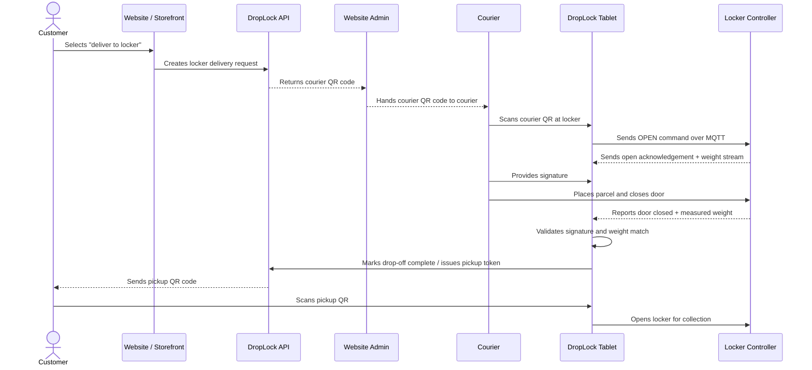

# DropLock

DropLock is an open source smart-locker ecosystem for secure parcel delivery and pickup. It is designed to be self-hosted, adapted, and deployed anywhere: apartment buildings, campuses, retail stores, offices, community hubs, or any place that needs unattended but accountable delivery handoff.

The project combines locker hardware, a tablet workflow, and an administrator dashboard. Website owners can integrate with a DropLock API from a separate repository to offer **"deliver to locker"** at checkout. When a customer chooses locker delivery, the website administrator receives a courier QR code. The courier scans that QR code at a DropLock locker, signs for the delivery, places the parcel inside, and closes the door. DropLock only accepts the drop-off when the signature is captured and the measured parcel weight matches the expected delivery. After a valid close, the user receives a pickup QR code to collect their parcel.

> **Status:** active prototype / work in progress. The repository includes Raspberry Pi locker-control code, a tablet-side orchestration app, a Streamlit admin dashboard, tests, architecture documents, and printable 3D models.

## Why DropLock?

- **Open source and hostable anywhere** — run your own deployment without depending on a single proprietary locker provider.
- **QR-based delivery and pickup** — couriers and customers use purpose-specific QR tokens instead of shared keys or static PINs.
- **Signature + weight validation** — a locker closes successfully only after the tablet records a signature and the hardware reports a matching parcel weight.
- **Admin visibility** — operators can monitor sectors, lockers, alerts, tamper state, heartbeats, and activity from a dashboard.
- **Hardware-first design** — the locker controller integrates lock relays, door sensors, magnetic contact sensors, and load cells.
- **Modular ecosystem** — dashboard, tablet, locker controller, API, and physical models can evolve independently.

## How it works



## Repository layout

| Path | Purpose |
| --- | --- |
| `Admin-Dashboard/` | Streamlit dashboard for owners and sector admins. Includes role-based navigation, locker operations, alert handling, audit views, provisioning helpers, and Firebase integration. |
| `Tablet-Module/` | Tablet application that scans QR tokens, validates access, orchestrates delivery/pickup sessions, captures signatures, listens to locker events, and issues follow-up tokens. |
| `Locker-Module/` | Raspberry Pi locker controller. Manages relays, door sensors, magnetic contact sensors, weight sensors, MQTT commands, heartbeat events, and close verification. |
| `System-Architecture/` | Architecture PDFs and sequence/use-case diagrams for admins, couriers, and users. |
| `3D Models/` | Printable `.3mf` models for the locker shell, door, controller housing, load-cell tray, tablet cover, and side covers. |

## Main components

### 1. DropLock API *(separate repository)*

The public API is expected to be integrated by website admins or ecommerce platforms. A typical integration creates a locker delivery request when a customer selects locker delivery at checkout, then returns or sends the QR token needed by the courier. After a successful drop-off, the ecosystem issues a pickup QR code for the customer.

This repository focuses on the locker, tablet, dashboard, physical models, and supporting workflows. API implementation details live outside this repository.

### 2. Admin Dashboard

The dashboard is built with Streamlit and Firebase. It helps operators:

- View locker and sector health.
- Open, cancel, create, delete, or mark lockers for maintenance.
- Monitor tamper and offline alerts.
- Review activity and booking history.
- Provision admin users and manage role-based access.
- Configure sectors without editing device code.

### 3. Tablet Module

The tablet module is the user-facing station at the locker. It:

- Reads courier and pickup QR codes.
- Validates tokens against Firebase / backend state.
- Publishes open and close commands to the locker controller over MQTT.
- Captures courier signatures.
- Applies close gates such as signature and weight requirements.
- Stores signatures locally and can send email notifications.
- Issues pickup tokens after a successful courier drop-off.

### 4. Locker Module

The locker module runs near the physical lockers, typically on Raspberry Pi-compatible hardware. It:

- Controls electric locks through relay pins.
- Reads door status from sensors.
- Reads magnetic contact state for tamper detection.
- Measures parcel weight through load-cell hardware.
- Publishes heartbeat, tamper, open, close, and weight events.
- Accepts MQTT commands from the tablet or admin flow.

## Delivery lifecycle

1. **Checkout** — customer chooses locker delivery on a participating website.
2. **Courier token** — the website admin receives a QR code from the DropLock API and gives it to the courier.
3. **Courier scan** — courier scans the QR code on the locker tablet.
4. **Locker opens** — tablet validates the token and sends an MQTT open command to the locker controller.
5. **Parcel insertion** — courier places the delivery in the locker.
6. **Signature capture** — tablet captures proof-of-delivery signature.
7. **Close verification** — locker accepts the close only if door state, signature state, and weight validation pass.
8. **Pickup token** — customer receives a one-time pickup QR code.
9. **Customer pickup** — customer scans the QR code and retrieves the parcel.
10. **Audit trail** — events, alerts, and status changes are available to admins.

## Technology stack

- **Python** for tablet, dashboard, and locker-controller software.
- **Streamlit** for the admin dashboard.
- **Firebase Authentication / Realtime Database** for admin auth, device context, locker state, and event data.
- **MQTT** for tablet-to-controller commands and controller-to-tablet events.
- **Raspberry Pi GPIO** for relays and sensors.
- **Load-cell weight sensing** for parcel validation.
- **QR tokens** for courier and pickup access.
- **3D-printable hardware models** for the locker enclosure and support parts.

## Getting started

### Prerequisites

- Python 3.10+ recommended.
- Firebase project with Authentication and Realtime Database enabled.
- MQTT broker reachable by the tablet and locker controller.
- Raspberry Pi-compatible device for the locker controller.
- Relay-controlled lock, door feedback sensor, MC-38-style magnetic sensor, and load-cell setup.
- Optional SMTP credentials for email notifications.

### Admin Dashboard

```bash
cd Admin-Dashboard
python -m venv .venv
source .venv/bin/activate
pip install -r requirements.txt
streamlit run app.py
```

You will need Firebase credentials and admin profiles configured before using the full dashboard. See `Admin-Dashboard/MODULE_GUIDE.txt` for a module-by-module overview.

### Tablet Module

```bash
cd Tablet-Module
python -m venv .venv
source .venv/bin/activate
pip install -r requirements.txt
cp env_example.sh .env.local
# edit .env.local with your Firebase, MQTT, SMTP, and device credentials
source .env.local
python main.py
```

Important tablet environment variables include:

- `FIREBASE_DB_URL`
- `FIREBASE_API_KEY`
- `DEVICE_EMAIL`
- `DEVICE_PASSWORD`
- `MQTT_HOST`
- `MQTT_PORT`
- `SIGNATURE_BASE_PATH`
- `WEIGHT_TOLERANCE_GRAMS`
- `COURIER_TOKEN_TTL_SEC`
- `PICKUP_TOKEN_TTL_SEC`

### Locker Module

```bash
cd Locker-Module
python main.py
```

The locker module is hardware-dependent and expects Raspberry Pi GPIO-compatible libraries and attached sensors/locks. Review `Locker-Module/main.py` and `Locker-Module/Locker_Module.py` before running on production hardware, especially GPIO pin assignments, MQTT TLS settings, sector IDs, and locker IDs.

## Testing

Run the available Python tests from the repository root:

```bash
python -m pytest Tablet-Module/Tests Locker-Module/Tests
```

Some tests may require mocked hardware interfaces or development dependencies depending on your environment.

## Security notes

- Treat QR codes as bearer credentials and keep token TTLs short.
- Use TLS for MQTT in real deployments.
- Protect Firebase service credentials and device credentials.
- Use separate Firebase accounts for admins and devices.
- Rotate courier and pickup tokens after use.
- Log access decisions, locker commands, and admin actions for auditability.
- Calibrate weight sensors before production use and define a realistic tolerance per locker.

## Roadmap ideas

- Public API documentation and SDK examples.
- Native ecommerce plugins.
- Better setup scripts for Raspberry Pi deployments.
- Docker Compose examples for self-hosted infrastructure.
- Dashboard charts and reporting.
- Command acknowledgement tracking.
- Bulk locker operations.
- Local AI summaries for maintenance and event logs.
- More automated integration tests with mocked Firebase and MQTT.

## Contributing

Contributions are welcome. Good first contributions include:

- Improving setup documentation.
- Adding tests around tablet session orchestration.
- Improving dashboard UX.
- Documenting hardware wiring and calibration.
- Adding API integration examples.
- Refining the 3D models or assembly guide.

Before opening a pull request, please run relevant tests and avoid committing secrets, Firebase keys, certificates, local `.env` files, or generated runtime data.

## License

DropLock is released under the license included in this repository. See [`LICENSE`](LICENSE) for details.
